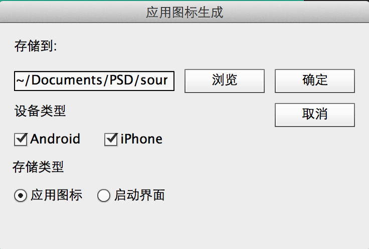

# AppShop
PhotoShop scripts for mobile apps!

## 关于
AppShop.jsx脚本文件可以将PSD文件保存为Android和iOS的应用图标及启动屏图片。

## 使用方法
1. 下载文件，将文件(AppShop.jsx)拷贝到PhotoShop的脚本文件所在目录，即可添加到脚本菜单
  1. 如在本人Mac OSX操作系统下，脚本文件目录为: 应用程序---Adobe PhotoShop CC---Presets---Scripts
  2. 打开PhotoShop, 依次点击：文件---脚本---AppShop，即可运行脚本。
  
2. 下载文件，放置于任意目录，使用时候执行即可
  1. 下载文件，放置于任意目录，如桌面
  2. 使用时候，打开PhotoShop，依次点击: 文件---脚本---浏览---脚本文件(AppShop.jsx)

**注:** 在不同的操作系统和不同PhotoShop版本下，位置可能有些不同。请根据情况调整。

## 资源文件
1. [PhotoShop Scripting Guide](./Resources/photoshop_scripting_guide.pdf)
2. [PhotoShop Script JavaScript Ref](./Resources/photoshop_scriptref_js.pdf)
3. [PhotoShop ToolsGuide](./Resources/JavaScriptToolsGuide_CS5.pdf)

## License
BSD License

Copyright (c) 2014, Allen Heavey
All rights reserved.

Redistribution and use in source and binary forms, with or without
modification, are permitted provided that the following conditions are met:

* Redistributions of source code must retain the above copyright notice, this
  list of conditions and the following disclaimer.

* Redistributions in binary form must reproduce the above copyright notice,
  this list of conditions and the following disclaimer in the documentation
  and/or other materials provided with the distribution.

* Neither the name of the {organization} nor the names of its
  contributors may be used to endorse or promote products derived from
  this software without specific prior written permission.

THIS SOFTWARE IS PROVIDED BY THE COPYRIGHT HOLDERS AND CONTRIBUTORS "AS IS"
AND ANY EXPRESS OR IMPLIED WARRANTIES, INCLUDING, BUT NOT LIMITED TO, THE
IMPLIED WARRANTIES OF MERCHANTABILITY AND FITNESS FOR A PARTICULAR PURPOSE ARE
DISCLAIMED. IN NO EVENT SHALL THE COPYRIGHT HOLDER OR CONTRIBUTORS BE LIABLE
FOR ANY DIRECT, INDIRECT, INCIDENTAL, SPECIAL, EXEMPLARY, OR CONSEQUENTIAL
DAMAGES (INCLUDING, BUT NOT LIMITED TO, PROCUREMENT OF SUBSTITUTE GOODS OR
SERVICES; LOSS OF USE, DATA, OR PROFITS; OR BUSINESS INTERRUPTION) HOWEVER
CAUSED AND ON ANY THEORY OF LIABILITY, WHETHER IN CONTRACT, STRICT LIABILITY,
OR TORT (INCLUDING NEGLIGENCE OR OTHERWISE) ARISING IN ANY WAY OUT OF THE USE

